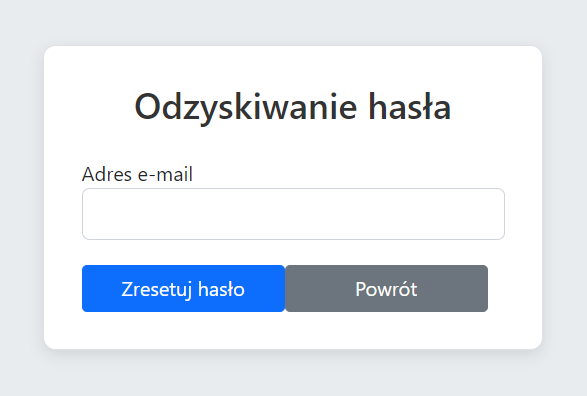
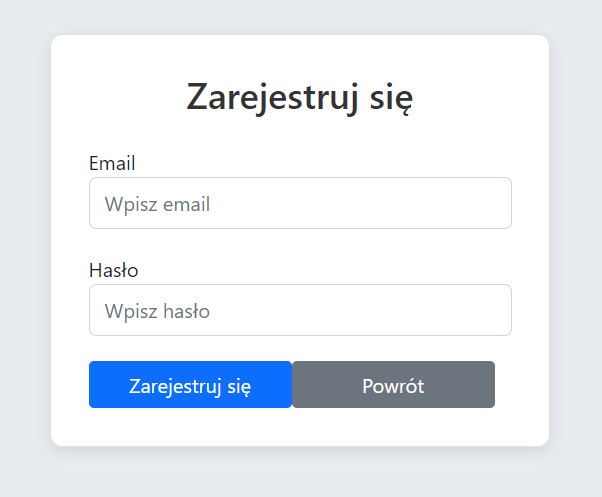
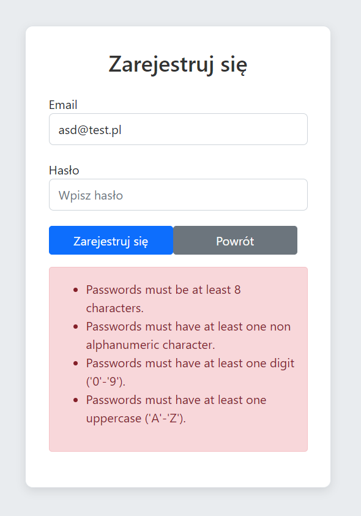
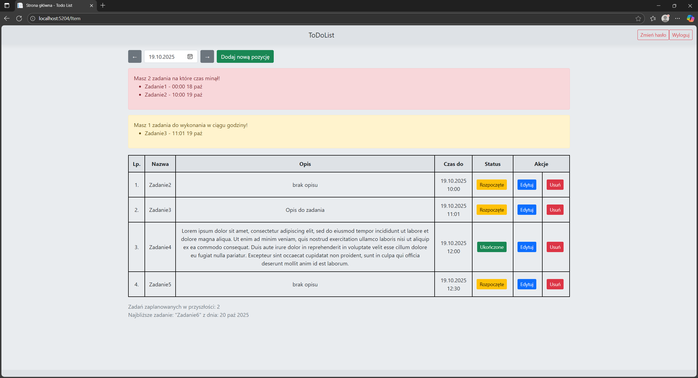
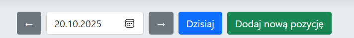
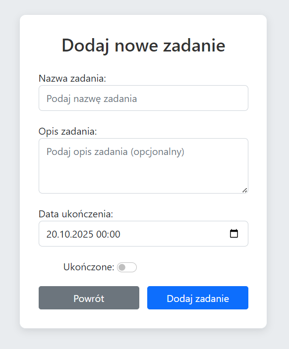
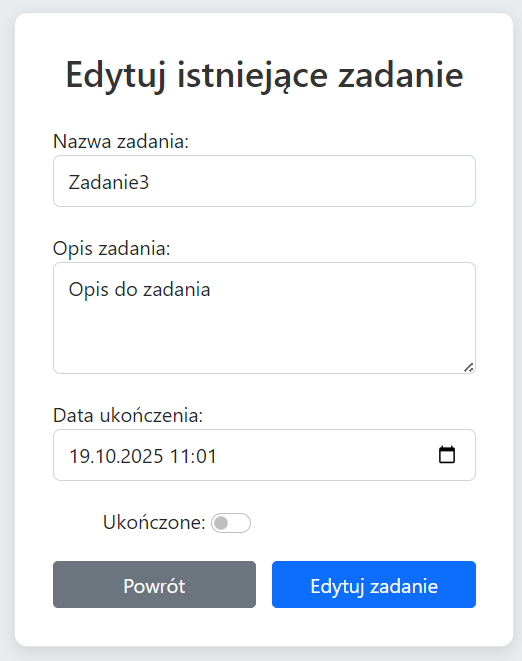
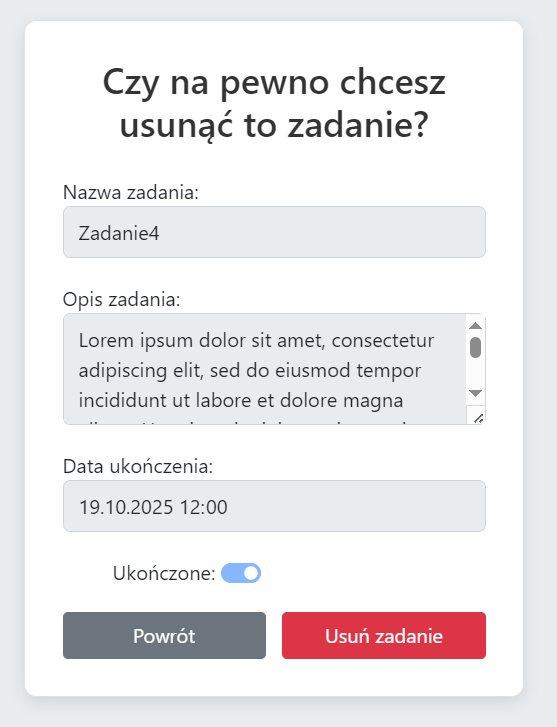
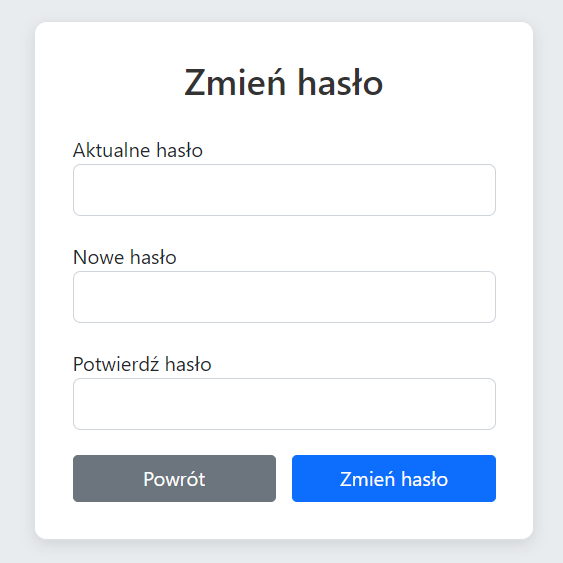
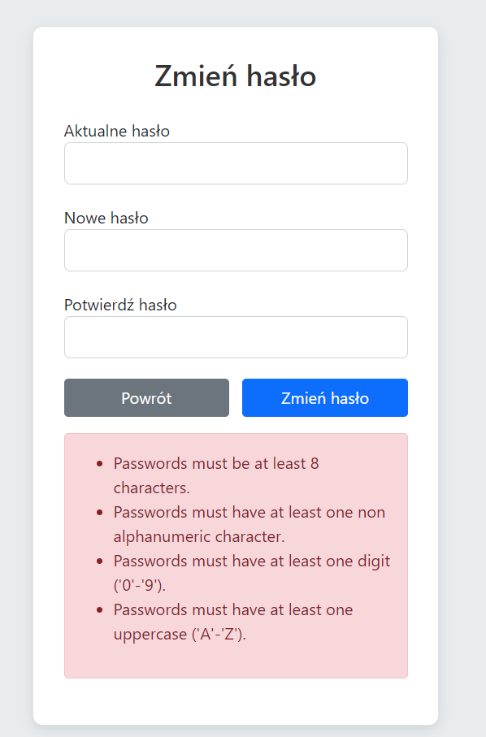

# ✅ ToDoList – Aplikacja ASP.NET Core MVC

Aplikacja do zarządzania zadaniami, napisana w technologii **ASP.NET Core MVC** z wykorzystaniem **Entity Framework Core** i **Bootstrap 5**.  
Pozwala na tworzenie, edycję, usuwanie oraz oznaczanie zadań jako ukończone, a także podgląd zadań z danego dnia oraz zadań przyszłych.

Link do repozytorium: [link](https://github.com/RockefellerEXE/ToDoList-Zadanie) <br/>
Live demo: [link](https://www.todolist.hostingasp.pl/)

---

## 📑 Spis treści

- [🚀 Uruchomienie lokalne](#-uruchomienie-lokalne)

  1. [Wymagania](#1-wymagania)
  2. [Klonowanie repozytorium](#2-klonowanie-repozytorium)
  3. [Przygotowanie bazy danych](#3-przygotowanie-bazy-danych)
  4. [Uruchomienie aplikacji](#4-uruchomienie-aplikacji)

- [📝 Instrukcja obsługi](#-instrukcja-obsługi)
  1. [Ekran logowania](#1-ekran-logowania)
  2. [Ekran rejestracji](#2-ekran-rejestracji)
  3. [Ekran główny](#3-ekran-główny)
  4. [Dodawanie zadania](#4-dodawanie-zadania)
  5. [Edycja zadania](#5-edycja-zadania)
  6. [Usuwanie zadania](#6-usuwanie-zadania)
  7. [Zmiana hasła](#7-zmiana-hasła)

## 🚀 Uruchomienie lokalne

### 1. Wymagania

- .NET 8.0
- Visual Studio 2022
- SQL Server LocalDB (instalowany domyślnie z Visual Studio)

---

### 2. Klonowanie repozytorium

Aby rozpocząć pracę lokalnie z projektem należy sklonować repozytorium z github:

```bash
git clone https://github.com/RockefellerEXE/ToDoList-Zadanie.git
```

Lub pobrać i rozpakować plik .zip


Po pobraniu otwieramy projekt w Visual Studio.

---

### 3. Przygotowanie bazy danych

Projekt korzysta z _Entity Framework Core_ i migracji.
Aby utworzyć bazę danych w Visual Studio wybierz zakładkę <br/>
Widok > Inne okna > Konsola menadżera pakietów i w niej wpisz

```bash
Update-Database -Context UsersContext
Update-Database -Context ItemsContext
```

Uruchomienie komend utworzy bazę danych.

---

### 4. Uruchomienie aplikacji

W Visual Studio wybierz projekt ToDoList jako startowy i uruchom aplikację (Ctrl + F5).
Domyślnie zostanie uruchomiona pod adresem: http://localhost:5204


# 📝 Instrukcja obsługi

### 1. Ekran logowania

Ekran logowania pozwala użytkownikowi na dostęp do aplikacji. W tym miejscu użytkownik wprowadza swój adres e-mail oraz hasło. Po wprowadzeniu danych kliknij przycisk **Zaloguj się**, aby przejść do strony głównej.


**Instrukcje:**

1. Wprowadź swój adres e-mail.
2. Wprowadź swoje hasło.
3. Kliknij przycisk **Zaloguj się**. (_Opcjonalnie: Zaznacz pole **Zapamiętaj mnie** aby przeglądarka zapamiędała użytkownika_).
4. Jeśli nie masz konta, przejdź do ekranu rejestracji, klikając **Zarejestruj się**.
5. Jeśli nie pamiętasz hasła kliknij **Nie pamiętam hasła**. Przeniesie cię to na ekran odzyskiwania hasła gdzie po podaniu adresu email zostanie na nie wysłane nowe hasło.



### 2. Ekran rejestracji

Ekran rejestracji umożliwia założenie nowego konta w aplikacji. Wprowadź wymagane dane, takie jak adres e-mail oraz hasło, a następnie kliknij **Zarejestruj się**.



**Instrukcje:**

1. Wprowadź adres e-mail.
2. Wprowadź swoje hasło.
3. Kliknij przycisk **Zarejestruj się**.

Jeśli nie spełnisz wymagań hasła otrzymasz odpowiednie powiadomienie.



### 3. Strona główna

Strona główna to miejsce, w którym użytkownik może zobaczyć swoje zadania, oraz dodać nowe. Na stronie znajdują się również przyciski umożliwiające edycję i usunięcie istniejących zadań. Za pomocą kalendarza lub strzałek można również nawigować pomiędzy poszczególnymi dniami.


**Funkcje:**

1. Wyświetlanie listy zadań.
2. Przycisk **Dodaj zadanie**, który przenosi do formularza dodawania nowego zadania.
3. Pole status pokazuje aktualny stan zadania. Kliknięcie w to pole zmieni stan zadania na przeciwny.
4. Przycisk **Edycja** obok każdego zadania przenosi do formularza pozwalającego
   edytować dane zadanie.
5. Przycisk **Usuń** obok każdego zadania pozwala przejść do formularza usunięcia zadania.
6. Jeśli ustalasz zadania na inny dzień zawsze możesz łatwo wrócić na dzisiejszy dzień klikając przycisk **Dzisiaj**



### 4. Dodawanie zadania

Aby dodać nowe zadanie, kliknij przycisk **Dodaj zadanie**. Następnie wprowadź szczegóły zadania, takie jak tytuł, opis oraz termin wykonania.



**Instrukcje:**

1. Wprowadź tytuł zadania.
2. Wprowadź szczegółowy opis zadania.
3. Ustaw datę wykonania zadania.
4. Kliknij przycisk **Zapisz**.
5. (_Opcjonalnie_) Zaznacz czy zadanie jest już ukończone.

### 5. Edycja zadania

Aby edytować zadanie, kliknij przycisk **Edytuj** obok wybranego zadania. Możesz zmienić tytuł, opis oraz datę wykonania.



**Instrukcje:**

1. Wprowadź zmiany w tytule lub opisie zadania.
2. Zmień datę wykonania zadania, jeśli to konieczne.
3. Kliknij przycisk **Zapisz zmiany**.
4. (_Opcjonalnie_) Zaznacz czy zadanie jest już ukończone.

### 6. Usuwanie zadania

Aby usunąć zadanie, kliknij przycisk **Usuń** obok zadania, które chcesz usunąć. Potwierdź swoją decyzję, aby zadanie zostało trwale usunięte.



**Instrukcje:**

1. Kliknij przycisk **Usuń** obok zadania.
2. Potwierdź usunięcie zadania.

### 7. Zmiana hasła

Aby zmienić swoje hasło, kliknij przycisk **Zmień hasło**. Przeniesie cię do formularza zmiany hasła. Wprowadź stare oraz nowe hasło, a następnie potwierdź zmiany.



**Instrukcje:**

1. Wprowadź stare hasło.
2. Wprowadź nowe hasło.
3. Potwierdź nowe hasło.
4. Kliknij przycisk **Zapisz zmiany**.

Jeśli nie spełnisz wymagań hasła otrzymasz odpowiednie powiadomienie.


